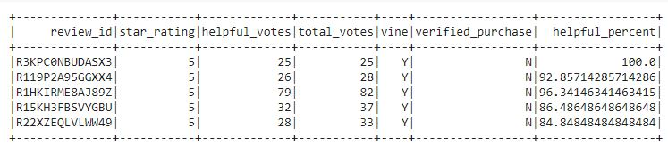
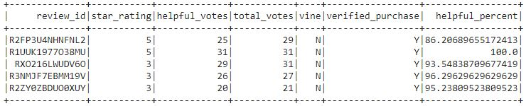

# Amazon_Vine_Analysis
## Overview
We are analyzing Outdoors products and focusing on reviews. Through this analysis we will determine if there is any bias in the data, depending on if the review was paid for or not. 

## Results
1. How many Vine reviews and non-Vine reviews were there?
* Vine Reviews: 103
* NonVine Reviews: 37372

2. How many Vine reviews were 5 stars? How many non-Vine reviews were 5 stars?
* 5* Vine Reviews: 55
* 5* NonVine Reviews: 19723

These reviews were filtered using Vine equal to Y/N

 

3. What percentage of Vine reviews were 5 stars? What percentage of non-Vine reviews were 5 stars?
* Percentage 5* Vine Reviews: 53.4%
* Percentage 5* NonVine Reviews: 52.8%

## Summary
There is a positive bias in the data for paid reviews in Vine, however it is only slightly at 0.6% (Vine: 53.4% and NonVine: 52.8%). We could take a look at seeing if there are any trends in verified purchases when reviews are paid or unpaid. At a glance it seems that NonVine reviews are verified_purchases, while Vine reviews are not.
